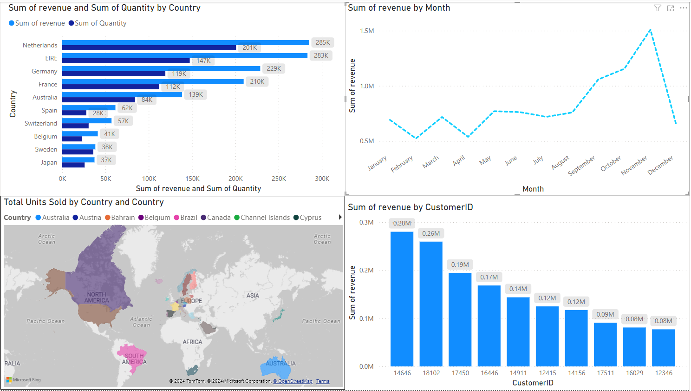

# Retail Business Intelligence (BI) Dashboard

## Overview
This project involves the creation of a Business Intelligence (BI) dashboard using Power BI on a retail dataset. The dashboard provides comprehensive insights into various aspects of retail operations such as sales performance, product trends, customer behavior, and more. The findings from the dashboard were presented to the Chief Executive Officer (CEO) and Chief Marketing Officer (CMO) for strategic decision-making.

## Files Included
- **tataviz.pbix**: Power BI file containing the interactive dashboard.
- **presentation_for_CMO.mp4**: Video presentation showcasing the key findings and insights from the dashboard.

## Dashboard Components
The Power BI dashboard consists of multiple visualizations and interactive elements including:
- **Sales Performance**: Visualizations depicting sales trends over time, by product category, and geographic region.
- **Product Analysis**: Insights into top-selling products, revenue contribution by product category, and product profitability.
- **Customer Segmentation**: Analysis of customer demographics, purchase behavior, and customer lifetime value (CLV).

## Presentation to CEO and CMO
The presentation video (presentation_for_CMO.mp4) provides a walkthrough of the dashboard highlighting key findings, insights, and actionable recommendations for the CEO and CMO. The presentation covers:
- Overview of retail business performance.
- Analysis of sales trends and factors influencing sales growth.
- Identification of high-performing products and customer segments.
- Evaluation of marketing campaign effectiveness and recommendations for optimizing marketing strategies.
- Insights into inventory management and recommendations for inventory optimization.
- Financial analysis and strategic recommendations for improving profitability and business growth.

## Conclusion
The Retail BI Dashboard and presentation provide valuable insights into various aspects of retail operations, enabling informed decision-making by the CEO and CMO. By leveraging data-driven insights, the retail business can enhance sales performance, optimize marketing efforts, improve inventory management, and drive overall business growth.

For a detailed walkthrough of the dashboard and presentation, please refer to the provided files.
